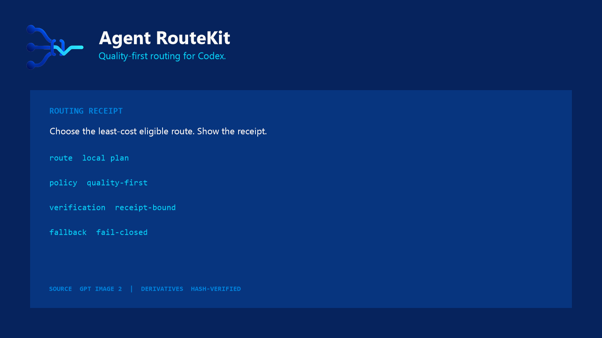

<p align="center">
  
</p>

# Local Model Route Planner

Plan the route, not the run.

Use Local Model Route Planner before execution when you have a local route registry and need the lowest-cost eligible model or agent plan. It checks quality, risk, capability, cost, and review requirements, explains why other options lost, and requires an independent verifier for high-risk work. It never calls a provider or proves that the selected route ran; it produces planning evidence only.

It is a Codex-first, provider-neutral planning and verification tool. It does **not** invoke models, modify Codex, host a gateway, or claim that a selected route actually ran. You declare task complexity, risk, minimum quality, and required capabilities; RouteKit selects an eligible execution route, requires an independent verifier when risk demands one, and emits a deterministic receipt.

> **Release state:** local publication hardening is complete when its targeted evidence passes. The product is not yet published; clean standalone history and the root-owned frozen-candidate gate remain required before release.



## Try it locally

From the repository root, run one platform-neutral command:

```text
python tools/demo.py
```

Exact output from the committed example registry and task:

```text
AGENT ROUTEKIT ROUTING RECEIPT
decision: 20fcf65b051dd038
task: review-auth-migration
executor: deep (provider/deep-model, maximum)
owner: senior-implementer
verifier: independent-review (provider/frontier-review-model, maximum)
quality floor: 3/4
risk: high
reason: Selected deep as the lowest-cost eligible execution route with an eligible independent verifier after enforcing quality floor 3/4, complex complexity, high risk, and all required capabilities. Selected independent-review as the lowest-cost eligible independent verifier.
limitation: planning evidence only; runtime execution must be proven separately.
```

The unit suite and release validator fail if this one-command demo or its documented receipt drifts from the canonical planner.

## Current compatibility and evidence

| Surface | Current state | Evidence boundary |
|---|---|---|
| Local Python CLI | Locally testable | Targeted unit tests, evaluation, and release validation exercise the bundled routine and high-risk examples. |
| Python versions and operating systems | CI configured | GitHub Actions targets Python 3.10 and 3.12 on Linux, macOS, and Windows; hosted results remain unobserved until publication. |
| Codex plugin package | Locally validated when evidence is current | The manifest, privacy, terms, and skills-only package are checked locally; installation from Git remains gated on a public repository. |
| Runtime dependencies | None | The planner and demo use only the Python standard library. Build tooling is separate from runtime. |
| Network and provider access | None | RouteKit reads local JSON and emits a plan. The host owns availability checks and model execution. |

## Install

### Codex plugin — recommended

These commands become live only after the approved repository is published:

```text
codex plugin marketplace add SpannDaMan/agent-routekit
codex plugin add agent-routekit@agent-routekit
```

Start a new Codex task after installation so the bundled skill is loaded into the new prompt.

For local testing, use the local marketplace path supported by your installed Codex version.

### Python CLI

```powershell
python -m pip install .
agent-routekit --version
```

The install is standard-library-only. It adds the `agent-routekit` console command while keeping the plugin script as the single implementation source.

## What it does

- Chooses the lowest-cost route only after quality, complexity, risk, and capability constraints pass.
- For high- and critical-risk tasks, chooses the lowest-cost complete executor/verifier plan.
- Fails closed when no eligible executor or complete independent-review plan exists.
- Emits stable JSON or human-readable receipts for review, tests, and CI.
- Reconciles a prior planning receipt with independently supplied outcome evidence without claiming causation or collecting the outcome.
- Rejects unknown fields so misspelled policy keys cannot silently change a decision.
- Runs locally with no account, API key, telemetry, network call, or hosted service.

## What it does not do

Local Model Route Planner plans and records a routing decision. It does not call a model provider, change Codex settings, prove which model ran, or grant an agent new authority. The host orchestration layer remains responsible for execution and separate runtime evidence.

## Where it fits

These categories can be combined; this is a boundary map, not a superiority ranking.

| Category | Typical job | Runtime model calls | RouteKit relationship |
|---|---|---:|---|
| Local Model Route Planner | Produce a deterministic pre-execution route and optional independent-verifier plan | No | Emits a receipt for a host to inspect or consume. |
| Runtime gateway | Proxy or dispatch provider requests while an application runs | Usually | May execute a RouteKit plan, but owns availability, credentials, retries, and runtime proof. |
| Learned router | Predict a route from training data, benchmarks, or online signals | Varies | Can be represented as a registry lane only if the host can enforce and verify it. |
| Orchestration plugin | Coordinate agents, tasks, tools, and execution state | Usually | May call RouteKit before execution; RouteKit does not replace orchestration. |

## Configure routes

Copy [`routes.example.json`](plugins/agent-routekit/routes.example.json) and replace the symbolic model labels with routes available in your environment. Each route declares:

- execution and/or verification roles;
- model, effort, and owner labels;
- cost rank and quality level;
- maximum task complexity and risk;
- capabilities and an independence group.

RouteKit treats model and effort values as labels. Availability must be verified by the host.

## Task contract

```json
{
  "id": "review-auth-migration",
  "summary": "Plan and review a security-sensitive authentication migration.",
  "complexity": "complex",
  "risk": "high",
  "minimum_quality": "high",
  "required_capabilities": ["analysis", "coding", "tool-use"],
  "independent_review": true
}
```

The task, registry, and receipt schemas live beside the plugin:

- [`task.schema.json`](plugins/agent-routekit/task.schema.json)
- [`registry.schema.json`](plugins/agent-routekit/registry.schema.json)
- [`receipt.schema.json`](plugins/agent-routekit/receipt.schema.json)
- [`outcome.schema.json`](plugins/agent-routekit/outcome.schema.json)

Reconcile independently supplied evidence after a host executes the selected route:

```text
agent-routekit reconcile --receipt planning-receipt.json --outcome independent-outcome.json
```

Publication remains held until one real host-independent case binds a declared baseline, planning receipt, independent runtime outcome, and deterministic reconciliation receipt. The included templates are not evidence.

## Commands

```text
agent-routekit validate-registry --registry <registry.json>
agent-routekit validate-task --task <task.json>
agent-routekit plan --registry <registry.json> --task <task.json> [--format json|text] [--output <path>]
```

## Safety model

1. Quality, complexity, risk, and capabilities are hard constraints.
2. Cost ranks only routes that already satisfy the constraints.
3. High-risk work gets a verifier from a different independence group or no route.
4. Receipts are planning evidence, not runtime proof.
5. Task summaries may be sensitive; sanitize them before sharing receipts or issues.

See [Threat Model](THREAT-MODEL.md), [Security Policy](SECURITY.md), and [Routing Contract](docs/ROUTING-CONTRACT.md).

## Test

```powershell
python -B -m unittest discover -s tests -v
python tools/demo.py
python tools/validate_release_candidate.py
```

The GitHub Actions workflow covers Python 3.10 and 3.12 on Linux, macOS, and Windows. The OpenAI plugin validator remains a release gate in the maintainer environment.

## Repository layout

```text
.agents/plugins/marketplace.json
.github/
plugins/agent-routekit/
  .codex-plugin/plugin.json
  assets/
  examples/
  scripts/routekit.py
  skills/agent-routekit/SKILL.md
  registry.schema.json
  task.schema.json
  receipt.schema.json
tests/
tools/
```

## Maintainer pilot

The first public release will use a 30-day maintainer pilot. No pilot has started or completed for this local candidate. See [MAINTAINER-PILOT.md](MAINTAINER-PILOT.md).

## Policies and release evidence

- [Privacy](PRIVACY.md) and [Terms](TERMS.md)
- [OpenAI/Codex submission packet](docs/OPENAI-PLUGIN-SUBMISSION.md)
- [Claude Code installation](docs/CLAUDE-INSTALL.md)
- [Release evidence contract](docs/RELEASE-EVIDENCE.md)
- [Evaluation guide](docs/EVALUATION.md)

## License

MIT © 2026 SpannDaMan. See [LICENSE](LICENSE).
